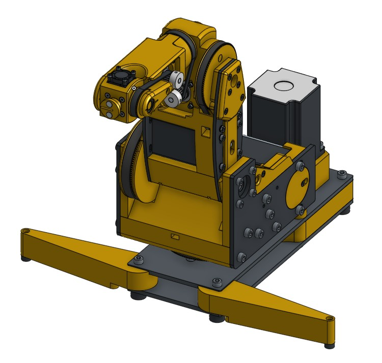

# ManiPy

Welcome to the **ManiPy** project! It's a fork of  **[SmallRobotArm](https://github.com/SkyentificGit/SmallRobotArm/tree/master)**. This design features a manipulator with six degrees of freedom, hobbyist robotic applications. 

## 🚀 Project Overview

This repository contains everything you need to build your own robotic arm, including:
- Full CAD files (OnShape)
- Step-by-step assembly guide for axis 1 and 2 (via Cadasio)
- Bill of Materials (BoM)
- Fabrication instructions for 3D printed and CNC/laser cut parts

## 📁 Project Resources

- 🔗 **[CAD Files](https://cad.onshape.com/documents/ec6ce001859c29e805ea5c1d/w/9fdfe26fe386f7819866a46c/e/0750c6352c7ca6b8f0f3346b?renderMode=0&uiState=6818fd7b17146b3626055890)**  
- 📘 **[Assembly Instructions](https://github.com/usereri/Manipy/tree/main/manuals)**  
- 📄 **[Bill of Materials](BOM.md)**

## 🧩 3D Printed Parts

Some parts of the manipulator must be 3D printed. The recommended parameters are:

- **Material**: ABS (or PC-CF for higher strength/temperature resistance)
- **Layer Height**: 0.2 mm
- **Infill**: 25–40% (gyroid recommended)

## 🛠️ CNC / Laser Cut Components

Several structural parts require more rigid materials and need to be either laser-cut or CNC-milled:

- **Material Options**:
  - **Aluminum Sheet** – 4 mm thickness (laser cut)
  - **Carbon Fiber Plate** – 4 mm thickness (CNC milled)

Parts requiring this method are labeled clearly in the BoM and CAD model. DXF files are included in the 
`CAD/fabrication` folder.

## 📦 Bill of Materials

You can find the complete BoM in the [BOM.md](BOM.md) file. It includes:
- All mechanical parts
- Motors and electronics
- Fasteners and bearings
- Links to sources and prices (when available)
- Manufacturing notes (3D printed, laser cut, etc.)

## 📸 Project Preview

Below is a photo/render of the assembled robotic arm:

## 📬 Contributing

Contributions, issues, and suggestions are welcome!

